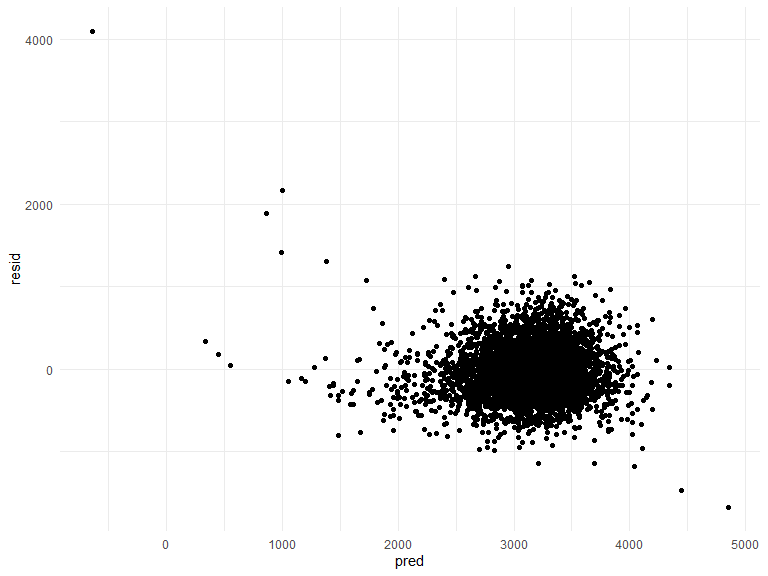
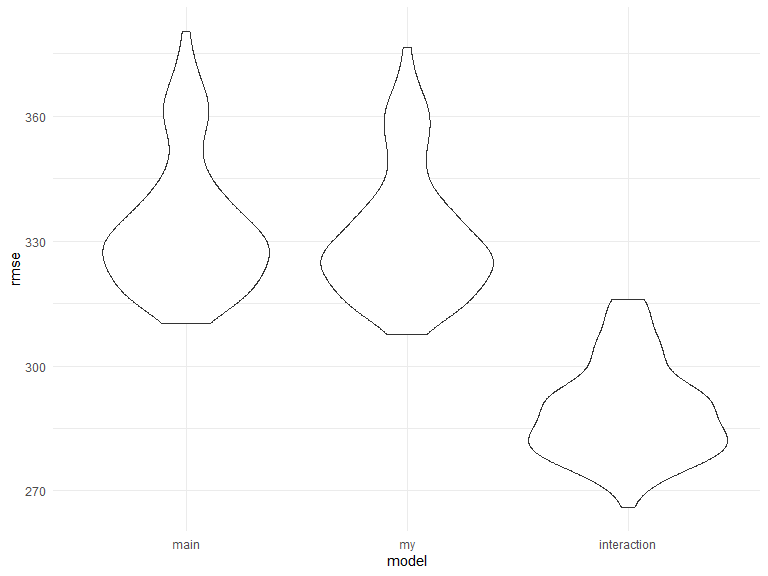

p8105_hw6_yl4924
================
Yongzheng Li
2022-12-3

# Apply package and inital setup

``` r
library(tidyverse)
```

    ## ── Attaching packages ─────────────────────────────────────── tidyverse 1.3.2 ──
    ## ✔ ggplot2 3.3.6      ✔ purrr   0.3.4 
    ## ✔ tibble  3.1.8      ✔ dplyr   1.0.10
    ## ✔ tidyr   1.2.0      ✔ stringr 1.4.1 
    ## ✔ readr   2.1.2      ✔ forcats 0.5.2 
    ## ── Conflicts ────────────────────────────────────────── tidyverse_conflicts() ──
    ## ✖ dplyr::filter() masks stats::filter()
    ## ✖ dplyr::lag()    masks stats::lag()

``` r
library(purrr)
library(modelr)
library(mgcv)
```

    ## Loading required package: nlme
    ## 
    ## Attaching package: 'nlme'
    ## 
    ## The following object is masked from 'package:dplyr':
    ## 
    ##     collapse
    ## 
    ## This is mgcv 1.8-40. For overview type 'help("mgcv-package")'.

``` r
knitr::opts_chunk$set(
    echo = TRUE,
    warning = FALSE,
    fig.width = 8, 
  fig.height = 6,
  out.width = "90%"
)

options(
  ggplot2.continuous.colour = "viridis",
  ggplot2.continuous.fill = "viridis"
)

scale_colour_discrete = scale_colour_viridis_d
scale_fill_discrete = scale_fill_viridis_d

theme_set(theme_minimal() + theme(legend.position = "bottom"))
```

# Problem 2

### Import and Clean the homicide dataset

``` r
url <- "https://raw.githubusercontent.com/washingtonpost/data-homicides/master/homicide-data.csv"
homicide_data <- read_csv(url) %>% 
  janitor::clean_names() %>%
  mutate(
    resolved = as.numeric(disposition == "Closed by arrest"),
    victim_age = as.numeric(victim_age),
    victim_race = fct_relevel(victim_race, "White")) %>% 
  unite("city_state", c(city, state), sep = ", ", remove = FALSE) %>% 
  filter(!(victim_race == "Unknown" | city_state == "Tulsa, AL")) %>% 
  filter(victim_race %in% c("White", "Black"))
```

    ## Rows: 52179 Columns: 12
    ## ── Column specification ────────────────────────────────────────────────────────
    ## Delimiter: ","
    ## chr (9): uid, victim_last, victim_first, victim_race, victim_age, victim_sex...
    ## dbl (3): reported_date, lat, lon
    ## 
    ## ℹ Use `spec()` to retrieve the full column specification for this data.
    ## ℹ Specify the column types or set `show_col_types = FALSE` to quiet this message.

After convert variable victim_age into numerical variable, it is worth
to note that there is 290 number of missing value of victim age.

### GLM for city of Baltimore, MD

``` r
baltimore_logistic <- 
  homicide_data %>% 
  filter(city_state == "Baltimore, MD") %>% 
  glm(resolved ~ victim_race + victim_age + victim_sex, data = ., family = binomial())


baltimore_logistic %>% 
  broom::tidy(conf.int = TRUE) %>% 
  mutate(OR = exp(estimate),
         conf.low = exp(conf.low),
         conf.high = exp(conf.high)) %>%
  select(term, log_OR = estimate, OR, contains("conf")) %>% 
  filter(term == "victim_sexMale")
```

    ## # A tibble: 1 × 5
    ##   term           log_OR    OR conf.low conf.high
    ##   <chr>           <dbl> <dbl>    <dbl>     <dbl>
    ## 1 victim_sexMale -0.854 0.426    0.324     0.558

### GLM for all cities in homicide dataset

``` r
nest_logistic_res =
  homicide_data %>% 
  nest(data = -city_state) %>% 
  mutate(
    models = purrr::map(data, ~glm(resolved ~ victim_race + victim_age + victim_sex, data = .x, family = binomial())),
    result = map(models, ~broom::tidy(.x, conf.int = TRUE))) %>% 
  unnest(result) %>% 
  mutate(
   OR = exp(estimate),
         conf.low = exp(conf.low),
         conf.high = exp(conf.high)) %>% 
  select(city_state, term, OR, contains("conf")) %>% 
  filter(term == "victim_sexMale") 
```

### plot

``` r
nest_logistic_res %>% 
  mutate(
    city_state = forcats::fct_reorder(city_state, OR)) %>% 
  ggplot(aes(x = city_state, y = OR)) +
  geom_point() +
  geom_errorbar(aes(ymin = conf.low, ymax = conf.high)) +
  theme(axis.text.x = element_text(angle = 60, hjust = 1)) +
  labs(title = "Estimated ORs & CIs for Solving Homicides Comparing Male Victims to Female Victims",
       y = "Estimated ORs")
```


From the plot, New York, NY has the lowest estimated OR for solving
homicides comparing male victims to female victims(around 0.25). City
Albuquerque, NM has the highest OR for solving homicides comparing male
victims to female victims(around 1.75). No city solving homicides for
males victims is significantly higher than solving homicides for female
victims. In contrast, there is 22 number of cities solving homicides for
males victims is significantly lower than solving homicides for female
victims.

# Problem 3

### import and clean dataset

``` r
birthweight <- 
  read_csv("./data/birthweight.csv") %>% 
  janitor::clean_names() %>% 
  mutate(
    malform = factor(malform, labels = c("absent", "present")),
    mrace = factor(mrace, labels = c("White", "Black", "Asian", "Puerto Rican")),
    frace = factor(frace, labels = c("White", "Black", "Asian", "Puerto Rican", "Other")),
    babysex = factor(babysex, label = c("male", "female"))) %>%
  drop_na()
```

    ## Rows: 4342 Columns: 20
    ## ── Column specification ────────────────────────────────────────────────────────
    ## Delimiter: ","
    ## dbl (20): babysex, bhead, blength, bwt, delwt, fincome, frace, gaweeks, malf...
    ## 
    ## ℹ Use `spec()` to retrieve the full column specification for this data.
    ## ℹ Specify the column types or set `show_col_types = FALSE` to quiet this message.

variable malform, mrace, frace, babysex is category variable, I convert
them from numercial to factor variable.

### Regression model for birthweight

``` r
model_1 <- lm(bwt ~ blength + gaweeks + smoken + momage + ppbmi, data = birthweight)
birthweight %>% 
  add_predictions(model_1) %>% 
  add_residuals(model_1) %>% 
  ggplot(aes(x = pred, y = resid)) +
  geom_point()
```



This model is based on hypothesized structure for the factors that
underly birthweight, the main effect include variables: baby length and
gestational age controlling for variables: number of cigarettes smoked
per day during pregnance, mother’s age at deliver, and mother’s
pre-pregnancy BMI. From resdiual vs fited value plot, most data are
centered around residual = 0. There are few data points has residual \>
1000. These data points need more investigation.

### Compare models

``` r
cv_df <- 
  crossv_mc(birthweight, 100) %>% 
  mutate(
    train = map(train, as_tibble),
    test = map(test, as_tibble))

cv_df <-
  cv_df %>% 
  mutate(
    main_model = map(train, ~lm(bwt ~ blength + gaweeks, data = .x)),
    my_model = map(train, ~lm(bwt ~ blength + gaweeks + smoken + momage + ppbmi, data = .x)),
    interaction_model = map(train, ~lm(bwt ~ blength * bhead * babysex , data = .x))) %>% 
  mutate(
    rmse_main = map2_dbl(main_model, test, ~rmse(model = .x, data = .y)),
    rmse_my = map2_dbl(my_model, test, ~rmse(model = .x, data = .y)),
    rmse_interaction = map2_dbl(interaction_model, test, ~rmse(model = .x, data = .y)))

cv_df %>% 
  select(starts_with("rmse")) %>% 
  pivot_longer(
    everything(),
    names_to = "model",
    values_to = "rmse",
    names_prefix = "rmse_") %>% 
  mutate(model = fct_inorder(model)) %>% 
  ggplot(aes(x = model, y = rmse)) + 
  geom_violin()
```



From the violin plot, the model that include all interactions clearly
has higher predictive accuracy gaining by model is more complex compare
to other 2 models.
