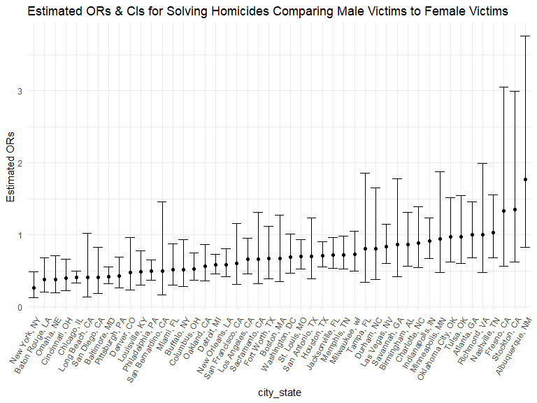

p8105_hw6_yl4924
================
Yongzheng Li
2022-12-3

# Apply package and inital setup

``` r
library(tidyverse)
```

    ## ── Attaching packages ─────────────────────────────────────── tidyverse 1.3.2 ──
    ## ✔ ggplot2 3.3.6      ✔ purrr   0.3.4 
    ## ✔ tibble  3.1.8      ✔ dplyr   1.0.10
    ## ✔ tidyr   1.2.0      ✔ stringr 1.4.1 
    ## ✔ readr   2.1.2      ✔ forcats 0.5.2 
    ## ── Conflicts ────────────────────────────────────────── tidyverse_conflicts() ──
    ## ✖ dplyr::filter() masks stats::filter()
    ## ✖ dplyr::lag()    masks stats::lag()

``` r
library(p8105.datasets)
library(purrr)

knitr::opts_chunk$set(
    echo = TRUE,
    warning = FALSE,
    fig.width = 8, 
  fig.height = 6,
  out.width = "90%"
)

options(
  ggplot2.continuous.colour = "viridis",
  ggplot2.continuous.fill = "viridis"
)

scale_colour_discrete = scale_colour_viridis_d
scale_fill_discrete = scale_fill_viridis_d

theme_set(theme_minimal() + theme(legend.position = "bottom"))
```

# Problem 2

### Import and Clean the homicide dataset

``` r
url <- "https://raw.githubusercontent.com/washingtonpost/data-homicides/master/homicide-data.csv"
homicide_data <- read_csv(url) %>% 
  janitor::clean_names() %>%
  mutate(
    resolved = as.numeric(disposition == "Closed by arrest"),
    victim_age = as.numeric(victim_age),
    victim_race = fct_relevel(victim_race, "White")) %>% 
  unite("city_state", c(city, state), sep = ", ", remove = FALSE) %>% 
  filter(!(victim_race == "Unknown" | city_state == "Tulsa, AL")) %>% 
  filter(victim_race %in% c("White", "Black"))
```

    ## Rows: 52179 Columns: 12
    ## ── Column specification ────────────────────────────────────────────────────────
    ## Delimiter: ","
    ## chr (9): uid, victim_last, victim_first, victim_race, victim_age, victim_sex...
    ## dbl (3): reported_date, lat, lon
    ## 
    ## ℹ Use `spec()` to retrieve the full column specification for this data.
    ## ℹ Specify the column types or set `show_col_types = FALSE` to quiet this message.

After convert variable victim_age into numerical variable, it is worth
to note that there is 290 number of missing value of victim age.

### GLM for city of Baltimore, MD

``` r
baltimore_logistic <- 
  homicide_data %>% 
  filter(city_state == "Baltimore, MD") %>% 
  glm(resolved ~ victim_race + victim_age + victim_sex, data = ., family = binomial())


baltimore_logistic %>% 
  broom::tidy(conf.int = TRUE) %>% 
  mutate(OR = exp(estimate),
         conf.low = exp(conf.low),
         conf.high = exp(conf.high)) %>%
  select(term, log_OR = estimate, OR, contains("conf")) %>% 
  filter(term == "victim_sexMale")
```

    ## # A tibble: 1 × 5
    ##   term           log_OR    OR conf.low conf.high
    ##   <chr>           <dbl> <dbl>    <dbl>     <dbl>
    ## 1 victim_sexMale -0.854 0.426    0.324     0.558

### GLM for all cities in homicide dataset

``` r
nest_logistic_res =
  homicide_data %>% 
  nest(data = -city_state) %>% 
  mutate(
    models = purrr::map(data, ~glm(resolved ~ victim_race + victim_age + victim_sex, data = .x, family = binomial())),
    result = map(models, ~broom::tidy(.x, conf.int = TRUE))) %>% 
  unnest(result) %>% 
  mutate(
   OR = exp(estimate),
         conf.low = exp(conf.low),
         conf.high = exp(conf.high)) %>% 
  select(city_state, term, OR, contains("conf")) %>% 
  filter(term == "victim_sexMale") 
```

### plot

``` r
nest_logistic_res %>% 
  mutate(
    city_state = forcats::fct_reorder(city_state, OR)) %>% 
  ggplot(aes(x = city_state, y = OR)) +
  geom_point() +
  geom_errorbar(aes(ymin = conf.low, ymax = conf.high)) +
  theme(axis.text.x = element_text(angle = 60, hjust = 1)) +
  labs(title = "Estimated ORs & CIs for Solving Homicides Comparing Male Victims to Female Victims",
       y = "Estimated ORs")
```


